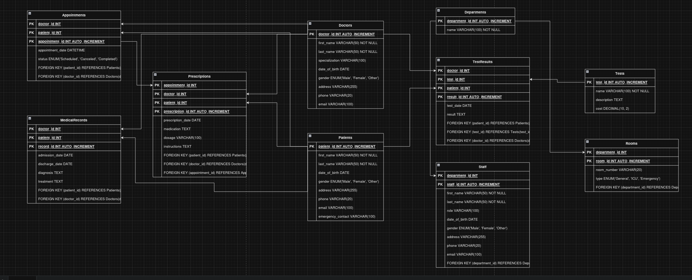

# Design Document

By [Abhinav Pangaria](https://github.com/18Abhinav07)
Edx- abhinavpangaria
Video Overview:

## Scope
Certainly! Here's an overview of the hospital management system database:

## Overview:

The hospital management system database is designed to facilitate the efficient management of various aspects of a hospital, including patient records, appointments, medical staff details, room allocations, prescriptions, tests, and more.

### Purpose:
The database serves the following purposes:
1. **Patient Management:** Storing and managing patient information, medical history, and appointments.
2. **Medical Staff Management:** Maintaining details of doctors, nurses, and other medical staff, including their specialties and departments.
3. **Facility Management:** Tracking room allocations, availability, and types.
4. **Medical Procedures:** Recording prescriptions, test results, and medical records.
5. **Appointment Scheduling:** Managing appointments between patients and medical staff.

### Functional Requirements:
The database supports the following functionalities:
1. **CRUD Operations:** Create, read, update, and delete operations for all entities.
2. **Appointment Management:** Schedule, update, and cancel appointments.
3. **Patient Record Keeping:** Maintain patient information, medical history, and prescriptions.
4. **Staff Management:** Manage details of doctors, nurses, and other medical staff.
5. **Room Allocation:** Assign and manage rooms for patient admission.
6. **Medical Procedure Recording:** Record prescriptions, tests, and medical records.
7. **Appointment Tracking:** Track appointments by date, time, doctor, and patient.

## Entities and Attributes:

### Patients:
- **Attributes:** patient_id (INT), first_name (VARCHAR), last_name (VARCHAR), date_of_birth (DATE), gender (ENUM), address (VARCHAR), phone (VARCHAR)
- **Constraints:** Primary key on patient_id.

### Doctors:
- **Attributes:** doctor_id (INT), first_name (VARCHAR), last_name (VARCHAR), department_id (INT), specialty (VARCHAR), gender (ENUM), phone (VARCHAR), email (VARCHAR)
- **Constraints:** Primary key on doctor_id, foreign key referencing Departments table on department_id.

### Nurses:
- **Attributes:** nurse_id (INT), first_name (VARCHAR), last_name (VARCHAR), department_id (INT), gender (ENUM), phone (VARCHAR), email (VARCHAR)
- **Constraints:** Primary key on nurse_id, foreign key referencing Departments table on department_id.

### Departments:
- **Attributes:** department_id (INT), name (VARCHAR)
- **Constraints:** Primary key on department_id.

### Appointments:
- **Attributes:** appointment_id (INT), doctor_id (INT), patient_id (INT), appointment_date (DATETIME), purpose (TEXT), status (ENUM)
- **Constraints:** Primary key on appointment_id, foreign keys referencing Doctors table on doctor_id and Patients table on patient_id.

### MedicalRecords:
- **Attributes:** record_id (INT), patient_id (INT), doctor_id (INT), room_id (INT), admission_date (DATE), discharge_date (DATE), diagnosis (TEXT), treatment (TEXT)
- **Constraints:** Primary key on record_id, foreign keys referencing Patients table on patient_id, Doctors table on doctor_id, and Rooms table on room_id.

### Prescriptions:
- **Attributes:** prescription_id (INT), doctor_id (INT), patient_id (INT), prescription_date (DATE), medication (TEXT), dosage (VARCHAR), instructions (TEXT)
- **Constraints:** Primary key on prescription_id, foreign keys referencing Doctors table on doctor_id and Patients table on patient_id.

### Tests:
- **Attributes:** test_id (INT), name (VARCHAR), description (TEXT), cost (DECIMAL)
- **Constraints:** Primary key on test_id.

### TestResults:
- **Attributes:** result_id (INT), test_id (INT), patient_id (INT), doctor_id (INT), result_date (DATE), result_details (TEXT)
- **Constraints:** Primary key on result_id, foreign keys referencing Tests table on test_id, Doctors table on doctor_id, and Patients table on patient_id.

### Rooms:
- **Attributes:** room_id (INT), type (VARCHAR), department_id (INT), status (ENUM)
- **Constraints:** Primary key on room_id, foreign key referencing Departments table on department_id.

### Staff:
- **Attributes:** staff_id (INT), department_id (INT), first_name (VARCHAR), last_name (VARCHAR), gender (ENUM), position (VARCHAR), phone (VARCHAR), email (VARCHAR)
- **Constraints:** Primary key on staff_id, foreign key referencing Departments table on department_id.

## Relationships:

## Optimization:
- **Indexing:** Indexes can be created on frequently queried columns such as patient_id, doctor_id, appointment_date, etc., to improve search performance.

## Limitations:
- **Collaborative Procedures:** The current schema assumes individual patient records and medical procedures. Handling collaborative procedures or group appointments would require modifications to the schema.
- **Security:** The database schema does not include explicit security measures such as user authentication and access control. Implementing these features would enhance data security and privacy.
